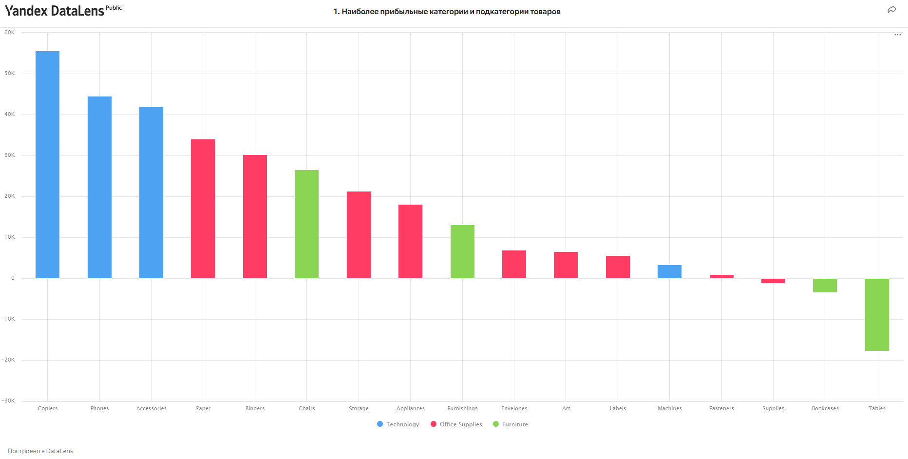
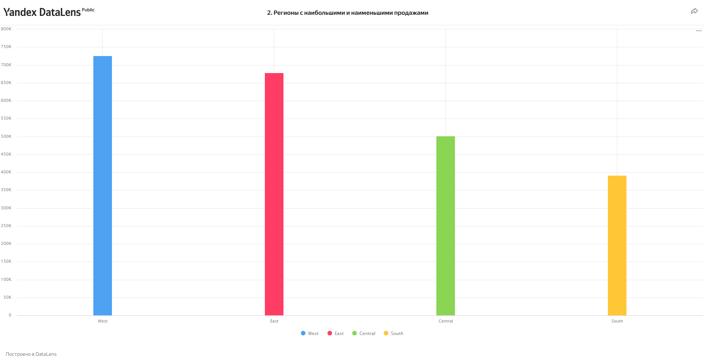
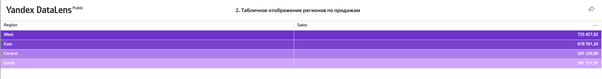
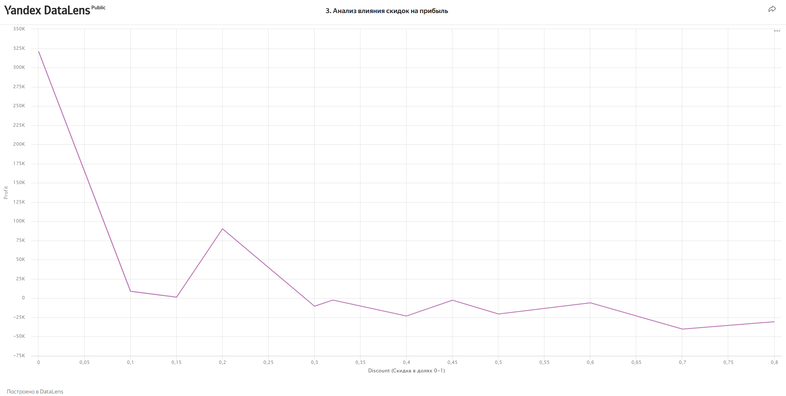
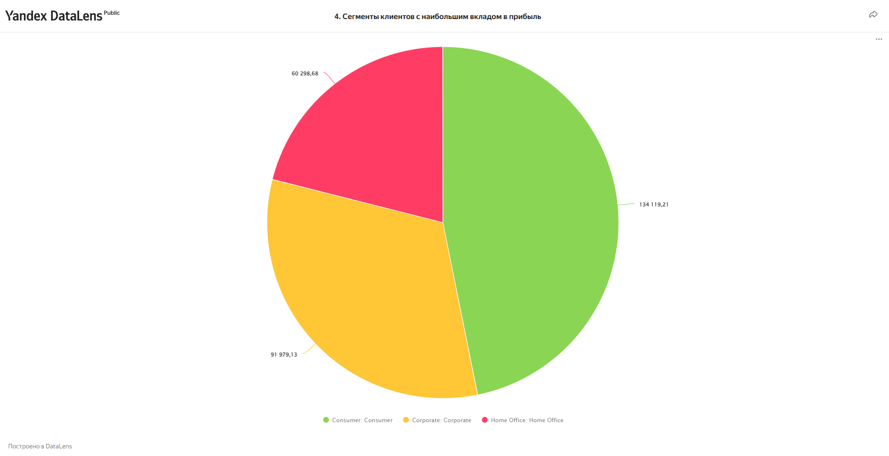

# Superstore Sales Dashboard — DataLens

Интерактивный аналитический дашборд, созданный с использованием **Yandex DataLens** на основе открытого датасета *Superstore*.  
Проект направлен на демонстрацию базовых навыков аналитики данных, визуализации и построения бизнес-отчётности.

## Цели проекта

1. Определить наиболее прибыльные категории и подкатегории товаров;
2. Выявить регионы с наибольшими и наименьшими продажами;
3. Проанализировать влияние скидок на прибыль;
4. Определить сегменты клиентов с наибольшим вкладом в прибыль.

## Инструменты
- **Yandex DataLens** (BI-система для построения дашбордов)
- **Excel** (предобработка дат)
- **Kaggle.com** — источник открытого датасета
- **GitHub** (публикация проекта)

## Состав репозитория

- `/dataset/` — исходный и очищенный датасет;
- `/screenshots/` — скриншоты дашборда;
- `README.md` — описание проекта;
- `dashboard_link.txt` — ссылка на публичный просмотр дашборда;
- `project_report.pdf` — PDF документ с постановкой задач, выводами, решением.

## Ссылка на дашборд (только для просмотра)

> [Смотреть дашборд в Yandex DataLens]

https://datalens.yandex/hyw15efomnye3

## Лицензия

Проект распространяется под лицензией **MIT**.

## Проведение анализа из полученного дашборта 
### 1. Наиболее прибыльные категории и подкатегории товаров

**Вывод:**
- Лидерами по прибыли стали товары из категории **Technology**, особенно **Copiers**, **Phones**, **Accessories**.
- Наименее прибыльные — **Tables** и **Bookcases** из категории **Furniture**, причём некоторые подкатегории даже убыточны (отрицательная прибыль).
  
**Рекомендации:**
- Увеличить инвестиции в наиболее прибыльные подкатегории.
- Проанализировать убыточные позиции: пересмотреть ценообразование, логистику или ассортимент.

---

### 2. Регионы с наибольшими и наименьшими продажами

**Вывод:**
- **West** и **East** — регионы с наибольшим объёмом продаж.
- **South** показывает наименьшие показатели.
- Таблица подчёркивает значительный разрыв между регионами по объёму продаж.

**Рекомендации:**
- Усилить маркетинг и логистику в отстающих регионах.
- Провести дополнительный анализ причин низких продаж в **South**.

---

### 3. Анализ влияния скидок на прибыль

**Вывод:**
- Чем выше скидка, тем ниже прибыль.
- Прибыль резко падает при скидках более **20%**.
- Максимальная прибыль достигается при **нулевых скидках**.

**Рекомендации:**
- Использовать скидки с осторожностью.
- Фокус на персонализированных предложениях вместо массовых распродаж.

---

### 4. Сегменты клиентов с наибольшим вкладом в прибыль

**Вывод:**
- Самый прибыльный сегмент — **Consumer**.
- Далее идут **Corporate** и **Home Office**, последний — наименее прибыльный.

**Рекомендации:**
- Усилить работу с сегментами **Consumer** и **Corporate**.
- Рассмотреть стратегии повышения вовлеченности и ценности для **Home Office**.

---

### ✅ Общий вывод

Данный анализ позволил:
- Выявить лидирующие и убыточные товарные подкатегории.
- Определить географические точки роста и слабые регионы.
- Установить, как скидки влияют на прибыльность.
- Оценить вклад разных клиентских сегментов.

Полученные инсайты — отличная база для принятия обоснованных решений по развитию стратегии продаж, маркетинга и оптимизации ассортимента.

## Навыки, использованные в проекте
- SQL (базовый)
- BI-инструменты: DataLens
- Работа с датами и форматами
- Визуализация и анализ данных
